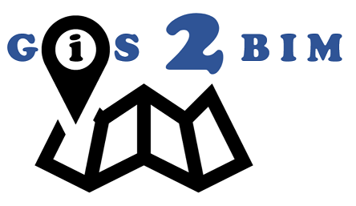

GIS2BIM is a collection of custom nodes for the Dynamo visual programming environment.  It imports 2D and 3D GIS-information to Autodesk Revit-models. 

To get an impression of GIS2BIM have a look at the workflows in the wiki: https://github.com/DutchSailor/GIS2BIM/wiki/Workflows

## Issues/questions
When you experience bugs, please issue them via 'Issues' in Github.

## Version
Version 0.10.0 released on 10-09-2019. This is the last version for Dynamo 1.x.(Revit 2019 and Dynamo 1.3.3.)

Version 0.11.22 released on 23-08-2021. This is the version for Dynamo 2.x. This dynamopackage is called 'GIS2BIM for Dynamo 2.x'
(Revit 2022 and Dynamo > 2.8.

0.11.18 can be used for Revit 2020, Revit 2021 and older dynamo versions.

## Installation
Installation is possible via the dynamo built-in package manager.

## Material on this repository
-Directory supportfiles contains files with families to use with the nodes and example files.

-Directory nodes contains the versions of the package and the actual nodes

## Help to develop GIS2BIM
If you are interested in contributing to GIS2BIM, please let me know! You're most welcome.

Notice that this version is very much a beta version, although it is in our opinion usable. If you use it, feedback is very much appreciated.

## More information
https://dutchrevitblog.blogspot.nl/

https://revitstructure-nl.blogspot.nl/

Have a look at the wiki! Every node has a description! https://github.com/DutchSailor/GIS2BIM/wiki
